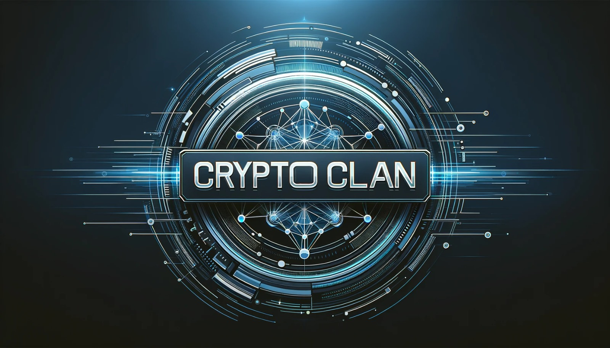

# Crypto Clan NFT Marketplace

> NFT marketplace DApp where users mint ERC721 implemented Crypto Clan NFTs.

</img>

## Features of this application

- The platform supports the creation and minting of personalized ERC721 Crypto Clan Tokens, allowing users to generate unique digital assets.

- A Token Marketplace is provided, enabling users to showcase and sell their Crypto Clan Tokens to interested parties.

- Sellers have the flexibility to determine the selling price of their Crypto Clan Tokens, providing a customizable pricing feature.

- Users can easily toggle the sale status of their tokens, deciding whether they want them available for purchase on the marketplace.

- The application maintains a comprehensive record of token ownership, encompassing both self-minted and purchased tokens associated with a user's account.

- Blockchain queries are facilitated, allowing users to extract information related to token ownership and metadata directly from the blockchain.

- To ensure fairness, there is a limitation on token minting, restricting users to create a new token only once every 5 minutes.

## How to run

### 1. Clone this repository
```
git clone 
```
### Install dependencies
```
cd 
npm install
```
### 2. Install Truffle and Ganache
```bash
npm install -g truffle ganache
```
### 3. Run Ganache
```
ganache --port 7545
```
### 4. Compile smart contract
```
truffle compile
```
### 5. Deploy smart contract to ganache
```
truffle migrate
```
### 6. Start the app
```
npm start
```

## Notes
- This app requires Metamask wallet extension.
- Import accounts from Ganache into the metamask wallet.
